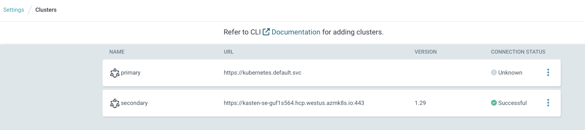

## Annex 2. Install ArgoCD on the primary cluster and reference the scondary 

Install ArgoCD on the primary cluster, adapt the value of the ingress 
```
kubectl create ns argocd 
helm repo add argo https://argoproj.github.io/argo-helm
helm install argo-release argo/argo-cd -n argocd -f argo-primary-values.yaml
```

Go to the ingress (in our case https://argocd.mcourcy-primary.customers.kastenevents.com/) login is `admin` and password is 
```
kubectl -n argocd get secret argocd-initial-admin-secret -o jsonpath="{.data.password}" | base64 -d
```

install argocd utility 
```
brew install argocd
```

Connect with the cli (provide the same admin and password)
```
argocd login argocd.mcourcy-primary.customers.kastenevents.com:443
```

Add the secondary cluster in argo so that argo can manage deployment on both clusters
```
argocd cluster add aks-cluster-mcourcy2-tf
```

You should see the two clusters in the UI 
