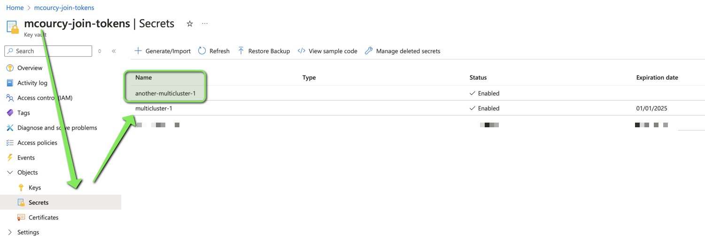

# Install ESO with Azure vault as a backend secret store 

## Consideration for the access to the Azure Key Vault

As I use AKS cluster I could use [managed identity](https://external-secrets.io/latest/provider/azure-key-vault/#managed-identity-authentication) for better security.

But if I was using openshift and wanted the maximum of security I would have to use federated identity with [short term credential](https://docs.openshift.com/container-platform/4.14/installing/installing_azure/installing-azure-customizations.html#installing-azure-with-short-term-creds_installing-azure-customizations). This specific installation of Openshift on Azure leverage the [Azure AD Workload Identity guide](https://azure.github.io/azure-workload-identity/docs/quick-start.html#6-establish-federated-identity-credential-between-the-aad-application-and-the-service-account-issuer--subject). Then you could follow this guide from the [redhat tutorial](https://access.redhat.com/solutions/7044926) that show how a service account in openshift can read the content of a secret in an azure keyvault using federated identity. The service account that would need to be updated is the service account of the ESO.
 

To keep it simple I will use [service Principal Key Authentification](https://external-secrets.io/latest/provider/azure-key-vault/#service-principal-key-authentication). This approach can be used on any kubernetes cluster (even on premise cluster) as long as your azure key vault has been securely configured. 

## Create the azure key vault 

Create a resource group for the keyvault that can be accessed
from both the subnet of the primary and the secondary clusters

```
# Adapt this values 
SUBSCRIPTION_ID=661b52f9-crez-4600-9e4b-ceProuTb09e4
SECRET_RESOURCE_GROUP=mcourcy-secret-rg
LOCATION=eastus
KEYVAULT_NAME=mcourcy-join-tokens
KEYVAULT_SECRET_NAME=multicluster-1
PRIMARY_RESOURCE_GROUP=rg-cluster-mcourcy1-tf
PRIMARY_VNET=vnet-cluster-mcourcy1-tf
PRIMARY_SUBNET=subnet-cluster-mcourcy1-tf
SECONDARY_RESOURCE_GROUP=rg-cluster-mcourcy2-tf
SECONDARY_VNET=vnet-cluster-mcourcy2-tf
SECONDARY_SUBNET=subnet-cluster-mcourcy2-tf

# create the resource group and its keyvault
# my organisation require purge protection and a default acces Deny
az group create --name $SECRET_RESOURCE_GROUP --location $LOCATION
az keyvault create --resource-group "${SECRET_RESOURCE_GROUP}" --location "${LOCATION}" --name "${KEYVAULT_NAME}" --enable-purge-protection true --default-action Deny

# Add Microsoft.KeyVault endpoint to the subnet of the the two clusters 
az network vnet subnet update --resource-group $PRIMARY_RESOURCE_GROUP --vnet-name $PRIMARY_VNET --name $PRIMARY_SUBNET --service-endpoints "Microsoft.KeyVault"
az network vnet subnet update --resource-group $SECONDARY_RESOURCE_GROUP --vnet-name $SECONDARY_VNET --name $SECONDARY_SUBNET --service-endpoints "Microsoft.KeyVault"

# And allow access to the keyvault from those subnets 
SUBNET_ID=$(az network vnet subnet show --resource-group $PRIMARY_RESOURCE_GROUP --vnet-name $PRIMARY_VNET --name $PRIMARY_SUBNET --query id --output tsv)
az keyvault network-rule add --name $KEYVAULT_NAME --resource-group $SECRET_RESOURCE_GROUP --subnet $SUBNET_ID
SUBNET_ID=$(az network vnet subnet show --resource-group $SECONDARY_RESOURCE_GROUP --vnet-name $SECONDARY_VNET --name $SECONDARY_SUBNET --query id --output tsv)
az keyvault network-rule add --name $KEYVAULT_NAME --resource-group $SECRET_RESOURCE_GROUP --subnet $SUBNET_ID

# for convenient reason also allow this operation from your own machine IP 
MY_IP=$(curl ifconfig.me)
# add the ip to the firewall rule of the keyvault
az keyvault network-rule add --name "${KEYVAULT_NAME}" --resource-group "${SECRET_RESOURCE_GROUP}" --ip $MY_IP
# add a role assignment to yourself 
MY_AZURE_ID=$(az ad signed-in-user show --query id -o tsv)
az role assignment create --role "Key Vault Secrets Officer" --assignee $MY_AZURE_ID --scope "/subscriptions/${SUBSCRIPTION_ID}/resourceGroups/${SECRET_RESOURCE_GROUP}/providers/Microsoft.KeyVault/vaults/${KEYVAULT_NAME}"
```

### Create a service principal that can read and write to the keyvault 

This command will output the appId, password, and tenant values in variable. We're going to store them in variables and allow this service principal to 
to do get and set operation on this keyvault.

```
### Create a service principal that can read and write to the Key Vault

# Create a service principal
SP=$(az ad sp create-for-rbac --name mc-tokens-manager --skip-assignment)
SP_APP_ID=$(echo $SP | jq -r .appId)
SP_PASSWORD=$(echo $SP | jq -r .password)
SP_TENANT=$(echo $SP | jq -r .tenant)

# Assign Key Vault access policies to the service principal
az role assignment create --role "Key Vault Secrets Officer" --assignee "${SP_APP_ID}" --scope "/subscriptions/${SUBSCRIPTION_ID}/resourceGroups/${SECRET_RESOURCE_GROUP}/providers/Microsoft.KeyVault/vaults/${KEYVAULT_NAME}"
```


# Let's run a test 

From your laptop create a token entry for the first multicluster instance
```
az keyvault secret set --vault-name "${KEYVAULT_NAME}" --name "${KEYVAULT_SECRET_NAME}" --value "IamAtestToken" --expires "2024-12-31T23:59:59Z"
```

You can rad this secret as well 
```
az keyvault secret show --vault-name $KEYVAULT_NAME --name $KEYVAULT_SECRET_NAME
```

Now we want to check that we are also able to read this secret from the aks cluster.
From both primary and secondary cluster :
```
kubectl -n default run az --image mcr.microsoft.com/azure-cli \
  --env=SP_APP_ID=$SP_APP_ID \
  --env=SP_PASSWORD=$SP_PASSWORD \
  --env=SP_TENANT=$SP_TENANT \
  --env=SP_SUBSCRIPTION_ID=$SUBSCRIPTION_ID \
  --env=KEYVAULT_NAME=$KEYVAULT_NAME \
  --env=KEYVAULT_SECRET_NAME=$KEYVAULT_SECRET_NAME \
  --command -- tail -f /dev/null
```

Enter the pod and login as a service principal and try to read the secret
```
kubectl -n default exec -it az -- bash
az login --service-principal --username $SP_APP_ID --password $SP_PASSWORD  --tenant $SP_TENANT
az keyvault secret show --vault-name $KEYVAULT_NAME --name $KEYVAULT_SECRET_NAME
```

You should see an output similar to this one
```
{
  "attributes": {
    "created": "2024-12-01T07:55:57+00:00",
    "enabled": true,
    "expires": "2024-12-31T23:59:59+00:00",
    "notBefore": null,
    "recoverableDays": 90,
    "recoveryLevel": "Recoverable",
    "updated": "2024-12-01T07:55:57+00:00"
  },
  "contentType": null,
  "id": "https://mcourcy-join-tokens.vault.azure.net/secrets/multicluster-1/c2aa28402b154d76bbd66cfff22f9034",
  "kid": null,
  "managed": null,
  "name": "multicluster-1",
  "tags": {
    "file-encoding": "utf-8"
  },
  "value": "IamAtestToken"
}
```

Check the service principal can update the secret
```
az keyvault secret set --vault-name "${KEYVAULT_NAME}" --name "${KEYVAULT_SECRET_NAME}" --value "IamAnothertestToken" 
```

Now you'll be able to configure and test ESO.

### Install ESO 

Install the operator on cluster primary and secondary 
```
helm repo add external-secrets https://charts.external-secrets.io
helm install external-secrets \
   external-secrets/external-secrets \
    -n external-secrets \
    --create-namespace
```

#### Create an azure keyvault secret store backend

On both cluster create the keyvault store backend
```
cat <<EOF | kubectl create -f -
apiVersion: v1
kind: Secret
metadata:
  name: eso-az-keyvault
  namespace: kube-system
stringData:
  clientId: $SP_APP_ID
  clientSecret: $SP_PASSWORD
  tenantId: $SP_TENANT
---
apiVersion: external-secrets.io/v1beta1
kind: ClusterSecretStore
metadata:
  name: azurekv-${KEYVAULT_NAME}-store
spec:
  provider:
    azurekv:
      authType: ServicePrincipal
      environmentType: PublicCloud
      tenantId: $SP_TENANT
      vaultUrl: "https://$KEYVAULT_NAME.vault.azure.net"
      authSecretRef:
        clientId:
          key: clientId
          name: eso-az-keyvault
          namespace: kube-system
        clientSecret: 
          key: clientSecret
          name: eso-az-keyvault
          namespace: kube-system
        tenantId:
          key: tenantId
          name: eso-az-keyvault
          namespace: kube-system
EOF   
```

You should get a valid status 
```
kubectl get clustersecretstores.external-secrets.io
NAME                                AGE   STATUS   CAPABILITIES   READY
azurekv-mcourcy-join-tokens-store   84s   Valid    ReadWrite      True
```

#### Check you can create a secret with information coming from the keyvault

```
cat <<EOF | kubectl create -f -
apiVersion: external-secrets.io/v1beta1
kind: ExternalSecret
metadata:
  name: ${KEYVAULT_SECRET_NAME}-join-token
  namespace: default
spec:
  refreshInterval: 1h
  secretStoreRef:
    kind: ClusterSecretStore
    name: azurekv-${KEYVAULT_NAME}-store
  target:
    name: ${KEYVAULT_SECRET_NAME}-join-token
    creationPolicy: Owner
  data:
  - secretKey: join-token
    remoteRef:
      key: ${KEYVAULT_SECRET_NAME}
EOF
```

Check if the external secret succeed in syncing 
```
kubectl get externalsecrets.external-secrets.io ${KEYVAULT_SECRET_NAME}-join-token -n default 
NAME                        STORE                               REFRESH INTERVAL   STATUS         READY
multicluster-1-join-token   azurekv-mcourcy-join-tokens-store   1h                 SecretSynced   True
```

Check the content of the created secret 
```
kubectl get secret ${KEYVAULT_SECRET_NAME}-join-token -n default -o jsonpath='{.data.join-token}' |base64 -d
IamAnothertestToken
```

#### Check you can push a secret to an azure vault with information coming from a secret in kubernetes


> **Notes**
> The pushSecret has by default an `updatePolicy` equal to `Replace` which means that if the secret already exist in the azure keyvauly ESO will try to delete and re-create the secret. 
> But in my specific organisation I cannot create an azure keyvault without a purge period. This configuration force the enablement of [softDelete](https://learn.microsoft.com/en-us/azure/key-vault/general/key-vault-recovery?tabs=azure-portal). When Push secret try to push on an existing secret it will first delete the secret and because softDelete is enabled that will put the secret in a recoverable state. Then ESO will try to create a secret with the same name but it will fail because a secret with the same name is already in recoverable state. 
> Hence the only solution is to use pushSecret on a non existing secret name. But this limitation may not affect you if your azure keyvault did not enabled `softDelete`.


Now let's create a push secret with another secret name 

```
cat <<EOF | kubectl create -f -
apiVersion: v1
kind: Secret
metadata:
  name: ${KEYVAULT_SECRET_NAME}-join-token
  namespace: default
stringData:
  join-token: "joinTokenPushedFromAKubernetesSecret"
---
apiVersion: external-secrets.io/v1alpha1
kind: PushSecret
metadata:
  name: ${KEYVAULT_SECRET_NAME}-join-token
  namespace: default
spec:
  refreshInterval: 1h # Refresh interval for which push secret will reconcile
  deletionPolicy: Delete
  updatePolicy: Replace
  secretStoreRefs: # A list of secret stores to push secrets to
    - name: azurekv-${KEYVAULT_NAME}-store
      kind: ClusterSecretStore
  selector:
    secret:
      name: ${KEYVAULT_SECRET_NAME}-join-token
  data:
    - match:
        secretKey: join-token
        remoteRef:
          remoteKey: "another-${KEYVAULT_SECRET_NAME}"
EOF
```

Check your pushSecret is synced 
```
k get pushsecrets.external-secrets.io
NAME                        AGE   STATUS
multicluster-1-join-token   11s   Synced
```

And check on the azure portal 


## Conclusion 

This conclude the configuration of the azure keyvault az a secret store for ESO. 
This configuration is a bit challenging but offer a good level of security and 
can be used for a lot of other deployment than multicluster. 