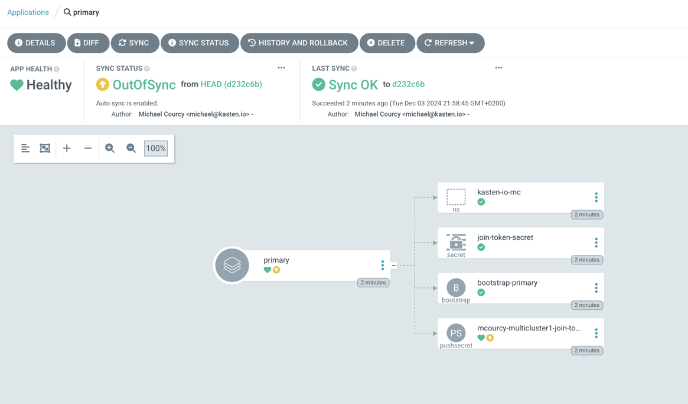
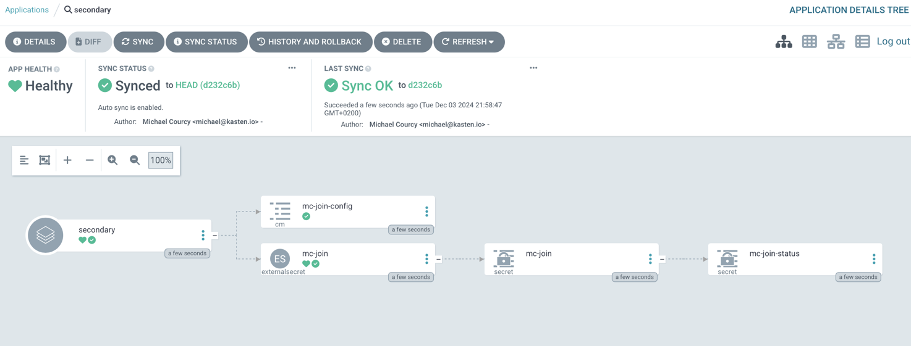
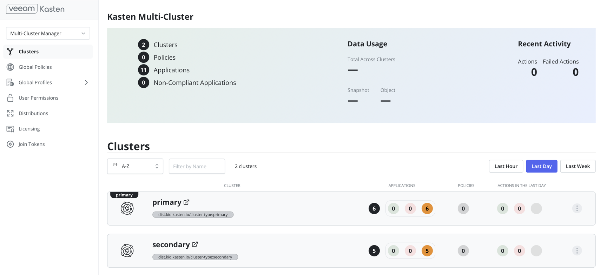

# Goal 

Deploy a Kasten multicluster configuration with argoCD following gitops practices.

# Challenges

Kasten multicluster [offer an API path to deploy a multicluster configuration](https://docs.kasten.io/latest/multicluster/getting_started.html#setting-up-via-cli) but we still have a challenge  : 
- On the primary Argo application we produce a secret (join-token) 
- That must be consumed by the secondary Argo Application (mc-join)

But there is no way in Argocd to pass the output of a first application as the input of a second application. 

# Proposal solution 

1. On the primary create a [bootstrap Primary](https://docs.kasten.io/latest/multicluster/getting_started.html#setting-up-the-primary-cluster-using-kubectl), a [join token](https://docs.kasten.io/latest/multicluster/getting_started.html#join-tokens) and use an ESO (External Secret Operator) [PushSecret](https://external-secrets.io/latest/api/pushsecret/) to push the secret on Azure Vault.
2. On the secondary application create a [join config map](https://docs.kasten.io/latest/multicluster/getting_started.html#join-configmap) and a [join secret](https://docs.kasten.io/latest/multicluster/getting_started.html#join-configmap) by pulling the token with an [ExternalSecret](https://external-secrets.io/latest/api/externalsecret/)

This is summarized in this diagram: 


# Prerequisite : 

Doing this is accually quite easy it require to deploy the manifest in [primary](./primary/) and [secondary](./secondary/). The hardest part is having proper prerequisites. 

- Kasten is installed on both cluster with an ingress controller and proper certificate. ([Annex 1](./annex1/)).
- Argo is installed on the primary cluster and we reference the secondary as a target deployment. ([Annex 2](./annex2/)).
- External secret operator is installed on both cluster using the same azure vault [secret store backend](https://external-secrets.io/latest/provider/azure-key-vault/) ([Annex 3](./annex3/)).

> **Notes:**
> Examples on the annexes are taken from my specific environment and there is tons of possible configurations. You'll have to adapt those examples following your architecture and security constraints. 


# Deploy the multicluster configuration with ArgoCD 

Given the prerequisites deploying the multicluster configuration is a matter of deploying manifest on primary and secondary.

To accomplish this with argo is a matter of defining 2 applications pointing on each cluster 
```
cat <<EOF | kubectl create -f -
apiVersion: argoproj.io/v1alpha1
kind: Application
metadata:
  name: primary
  namespace: argocd
spec:
  destination:
    namespace: kasten-io-mc
    server: https://kubernetes.default.svc
  project: default
  source:
    path: primary
    repoURL: https://github.com/michaelcourcy/kasten-multicluster-argocd
    targetRevision: HEAD
  syncPolicy:
    automated: {}
---
apiVersion: argoproj.io/v1alpha1
kind: Application
metadata:
  name: secondary
  namespace: argocd
spec:
  destination:
    namespace: kasten-io
    # adapt this value to your configuration
    server: https://kasten-se-guf1s564.hcp.westus.azmk8s.io:443
  project: default
  source:
    path: secondary
    repoURL: https://github.com/michaelcourcy/kasten-multicluster-argocd
    targetRevision: HEAD
  syncPolicy:
    automated: {}
EOF
```

# Check multicluster deployment 

On the primary all the resources should be healthy especially the `pushSecret` because it was able to find the token key in the `join-token-secret` secret.



On the secondary you notice the ownership between the `externaSecret` and the join secret `mc-join`



Finally you should see on the primary cluster the multicluster automatically deployed



# Clean multicluster installation 

https://docs.kasten.io/latest/multicluster/how-tos/disconnect.html

## On the primary 

```
kubectl delete  applications.argoproj.io -n argocd --all
kubectl delete clusters.dist.kio.kasten.io -n kasten-io-mc -l dist.kio.kasten.io/cluster-type=secondary
# Wait for the deletion of the secondaries artifacts on the other secondaries clusters
sleep 10
kubectl delete clusters.dist.kio.kasten.io -n kasten-io-mc -l dist.kio.kasten.io/cluster-type=primary
kubectl delete -n kasten-io-mc pushsecret mcourcy-multicluster1-join-token
kubectl delete ns kasten-io-mc
```

## On the secondary 

```
kubectl delete -n kasten-io externalsecrets.external-secrets.io mc-join
# if deletion was clean on the primary those actions are useless
kubectl delete -n kasten-io cm mc-join-config
kubectl delete -n kasten-io secret mc-cluster-info
```


