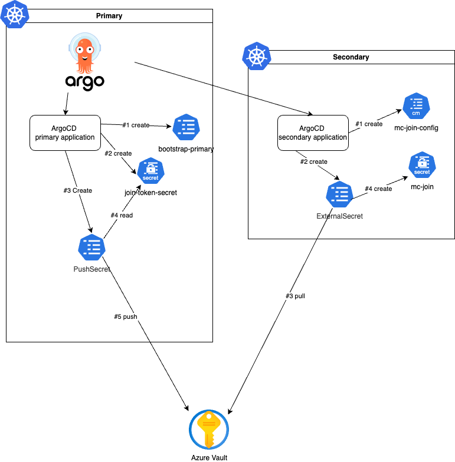

# Goal 

Deploy a Kasten multicluster configuration with argoCD following gitops practices.

# Challenges

Kasten multicluster [offer an API path to deploy a multicluster configuration](https://docs.kasten.io/latest/multicluster/getting_started.html#setting-up-via-cli) but we still have a challenge  : 
- On the primary Argo application we produce a secret (join-token) 
- That must be consumed by the secondary Argo Application (mc-join)

But there is no way in Argocd to pass the output of a first application as the input of a second application. 

# Proposal solution 

1. On the primary create a [bootstrap Primary](https://docs.kasten.io/latest/multicluster/getting_started.html#setting-up-the-primary-cluster-using-kubectl), a [join token](https://docs.kasten.io/latest/multicluster/getting_started.html#join-tokens) and use an ESO (External Secret Operator) [PushSecret](https://external-secrets.io/latest/api/pushsecret/) to push the secret on Azure Vault.
2. On the secondary application create a [join config map](https://docs.kasten.io/latest/multicluster/getting_started.html#join-configmap) and a [join secret](https://docs.kasten.io/latest/multicluster/getting_started.html#join-configmap) by pulling the token with an [ExternalSecret](https://external-secrets.io/latest/api/externalsecret/)

This is summarized in this diagram: 



# Prerequisite : 

- Kasten is installed on both cluster with an ingress controller and proper certificate. ([Annex 1](./annex1/)).
- Argo is installed on the primary cluster and we reference the secondary as a target deployment. ([Annex 2](./annex2/)).
- External secret operator is installed on both cluster using the same azure vault [secret store backend](https://external-secrets.io/latest/provider/azure-key-vault/) ([Annex 3](./annex3/)).

> **Notes:**
> Examples on the annexes are taken from my specific environment and there is tons of possible configurations. You'll have to adapt those examples following your architecture and security constraints. 


# Deploy the multicluster configuration with ArgoCD 

Given the prerequisites deploying the multicluster configuration is a matter on deploying manifest on primary and secondary.

To accomplish this with argo is a matter of defining 2 applications pointing on each cluster 
```
cat <<EOF 

EOF
```


# Clean multicluster installation 

https://docs.kasten.io/latest/multicluster/how-tos/disconnect.html

## On the primary 

```
kubectl delete cluster secondary -n kasten-io-mc # wait for the primary cleaning up resource on the secondary
kubectl delete cluster primary -n kasten-io-mc
kubectl delete delete -n kasten-io-mc pushsecret mcourcy-multicluster1-join-token
```

## On the secondary 

```
kubectl delete -n kasten-io externalsecrets.external-secrets.io mc-join
```


